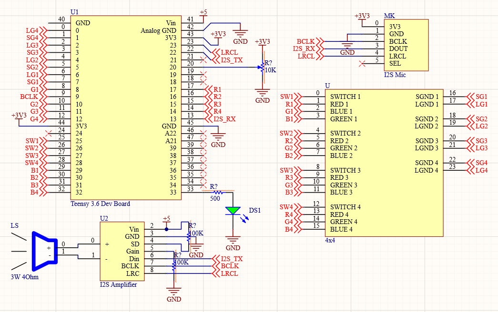

# SoundBoard

### Summary:
 Teensy 3.6 based Soundboard with 2 recordable sound effects, 11 programmable sound effects, and 1 programmable FIR filter. The recordable sound effects are recorded into .RAW files in an SD card on the Teensy. The programmable sound effects are saved as .WAV files on the SD card. Only the left channel is played on the WAV files with the way the I2S amplifier is set up. It is possible to set it up as average right left channels. Volume control is implemented through a potentiometer. Volume is controlled via software by performing bit shifting based on the read analog value.
 
 The final code for the project is located in the file sound_board. sound_board includes lpf.h and lpf.cpp which contain the 200 tap digital filter used in the filter button. Filter design was preliminarily done on jupyter notebook (python) using a rememz exchange algorithm, but the final version was done using a filter design website using TFilter (http://t-filter.engineerjs.com/) as to generate integer taps instead of float taps. Only FIR filters up to 200 taps are supported. Bit crushers are also used to create a "low- quality" sound effect along with the filter. It is simple to disable this in the code.
 
 Buttons readings and RGB colors on the button board are generated through a matrix keyboard scanning algorithm implemented via the periodic interrupt timers on the ARM processors. Button debouncing is done via software.
 
 All other files are code to test different hardware components to this projects including the LED matrix button board and I2S microphone. Most of the coding is done on Arduino IDE as to utilize the nicely developed sound libraries from Teensy (especially the I2S drivers). 

### Components:

* Teensy 3.6 development board: https://www.sparkfun.com/products/14057
* I2S MEMS Microphone (SPH0645LM4H): https://www.adafruit.com/product/3421
* I2S Audio Amplifier (Class D - 3W): https://www.adafruit.com/product/3006
* 3W 4 Ohm Speaker: https://www.adafruit.com/product/1314
* RGB Matrix-Scan Buttonpad (4x4): https://learn.sparkfun.com/tutorials/button-pad-hookup-guide (Multiple components for the buttonpad listed in this link)
* Various resistors, LEDs, potentiometers, diodes, etc...

### Schematic:

